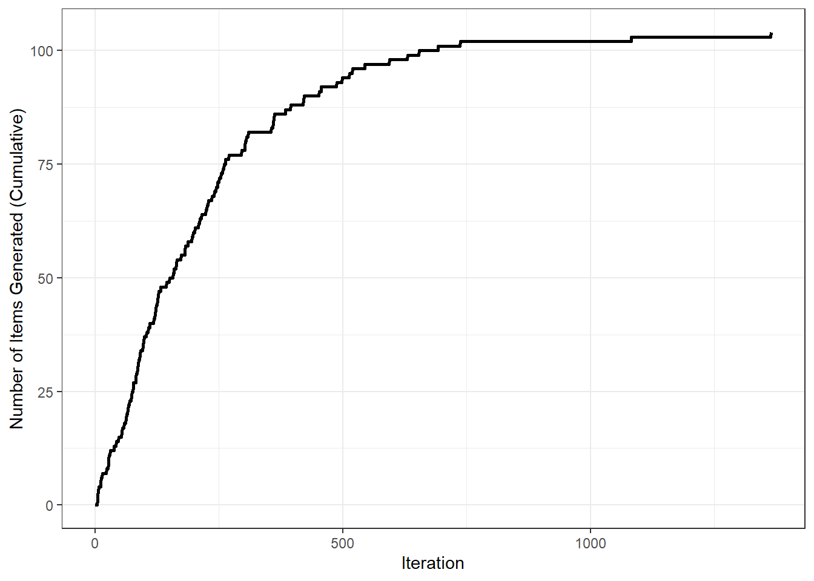

# The Generate Pipeline


## Generating Stimuli

LexOPS can generate controlled stimuli for (almost?) any possible factorial design. This can be done in a pipeline using 3 main functions:

<br>
<div class="float-third-left">
<p><code>split_by()</code></p>
<p>to specify “splits” (independent variables) in the experimental
design</p>
</div>

<div class="float-third-centre">
<p><code>control_for()</code></p>
<p>to specify variables that should be controlled for between
conditions</p>
</div>

<div class="float-third-right">
<p><code>generate()</code></p>
<p>to run the algorithm and generate the stimuli, using specified splits
and controls</p>
</div>
<br>

### A Practical Example {-}

Imagine we want to generate stimuli for a 2x2 factorial design in a Lexical Decision Task, examining whether a possible effect of bigram probability interacts with concreteness.

For this, we might decide we want a stimulus set with the following features:

* Filtered such that **at least 90% of people know each word**, according to Brysbaert, Mandera, McCormick, and Keuleers (2019).

* **Two levels of Concreteness** (abstract and concrete words) according to Brysbaert, Warriner and Kuperman (2014).

* **Two levels of Bigram Probability** (low and high probability) based on SUBTLEX-UK (van Heuven, Mandera, Keuleers, & Brysbaert, 2014).
  
* **Controlled for word length** (number of characters) exactly.

* **Controlled for word frequency** within ±0.2 Zipf, according to according to SUBTLEX-UK (van Heuven, Mandera, Keuleers, & Brysbaert, 2014).

* **25 words for each of the generated conditions** (100 stimuli in total).

<br>
We can use the following R code to generate a stimulus list like this with LexOPS:


``` r
library(LexOPS)

stim <- lexops |>
  subset(PK.Brysbaert >= 0.9) |>
  split_by(CNC.Brysbaert, 1:2 ~ 4:5) |>
  split_by(BG.SUBTLEX_UK, 0:0.003 ~ 0.009:0.013) |>
  control_for(Length, 0:0) |>
  control_for(Zipf.SUBTLEX_UK, -0.2:0.2) |>
  generate(n = 25)
```

<br>
<div class="info">
<p>Important notes on LexOPS (non-standard) syntax:</p>
<ul>
<li><p>As in the tidyverse, variables in the dataframe can be referenced
outside of quotation marks.</p></li>
<li><p>The <code>:</code> character is used in <code>split_by()</code>
to specify numeric boundaries (e.g. <code>0.009:0.013</code> means any
number from 0.009 to 0.013 is acceptable for this level of the
variable), and in <code>control_for()</code> to specify tolerances
(e.g. <code>-0.2:0.2</code> means controls will be acceptable if within
±0.2 of the match null).</p></li>
<li><p>The <code>~</code> character is used in <code>split_by()</code>
to specify different levels of an independent variable
(e.g. <code>1.5:2.5 ~ 3.5:4.5 ~ 5.5:6.5</code> would specify three
levels).</p></li>
</ul>
</div>
<br>

### Output {-}

Let's have a closer look at the first 5 rows of `stim`, which contains the output from above:

<div class = 'table'>

| item_nr|A1_B1    |A1_B2    |A2_B1    |A2_B2    |match_null |
|-------:|:--------|:--------|:--------|:--------|:----------|
|       1|ahoy     |sane     |burp     |bong     |A2_B1      |
|       2|subtlety |reasoned |choirboy |minstrel |A1_B2      |
|       3|unsafe   |regain   |juggle   |strand   |A1_B2      |
|       4|dynamics |inferior |bagpipes |intruder |A2_B2      |
|       5|signify  |rousing  |crumpet  |warthog  |A2_B2      |

</div>

<br>
We can see that we have 4 conditions:

* **A1_B1** (abstract, low probability)

* **A1_B2** (abstract, high probability)

* **A2_B1** (concrete, low probability)

* **A2_B2** (concrete, high probability)

<br>
Each row of the dataframe is controlled for in terms of frequency and length. The `match_null` variable tells us which condition stimuli were matched relative to. For instance, we can see that in row 3, items are matched relative to the word "regain". This means that all words for `item_nr` 3 are within ±0.2 Zipf of the Zipf value associated with the word "regain". By default, LexOPS will select the match_null for each item pseudo-randomly, such that each condition will be used as a match null an equal number of times (`match_null = "balanced"`), or as close to this ideal as is possible (e.g. the number of items requested may not be divisible by the number of conditions). See [this FAQ section](faq.html#what-is-a-match-null) for more information on match nulls.

## Converting to Long Format

The table above shows the generated stimuli in wide format. This is a useful way to quickly view the stimuli and get a sense for what has been generated, but we often want to check our stimuli in more detail. The `long_format()` function is a quick way to convert stimuli generated in LexOPS into long format:


``` r
stim_long <- long_format(stim)
```

Now we have the same stimuli in long format, with their associated values. Here are the same first 5 matched items from earlier, but in long format:

\small
<div class = 'table'>

| item_nr|condition |match_null |string   | Zipf.SUBTLEX_UK| Length| BG.SUBTLEX_UK| CNC.Brysbaert|
|-------:|:---------|:----------|:--------|---------------:|------:|-------------:|-------------:|
|       1|A1_B1     |A2_B1      |ahoy     |        3.270924|      4|     0.0024671|          2.00|
|       1|A1_B2     |A2_B1      |sane     |        3.351834|      4|     0.0097561|          1.79|
|       1|A2_B1     |A2_B1      |burp     |        3.311686|      4|     0.0029034|          4.34|
|       1|A2_B2     |A2_B1      |bong     |        3.450084|      4|     0.0095689|          4.27|
|       2|A1_B1     |A1_B2      |subtlety |        2.913220|      8|     0.0025943|          1.54|
|       2|A1_B2     |A1_B2      |reasoned |        2.729160|      8|     0.0101181|          1.64|
|       2|A2_B1     |A1_B2      |choirboy |        2.559059|      8|     0.0027849|          4.56|
|       2|A2_B2     |A1_B2      |minstrel |        2.905251|      8|     0.0100126|          4.11|
|       3|A1_B1     |A1_B2      |unsafe   |        3.487426|      6|     0.0023499|          1.89|
|       3|A1_B2     |A1_B2      |regain   |        3.532060|      6|     0.0099835|          1.79|
|       3|A2_B1     |A1_B2      |juggle   |        3.365053|      6|     0.0024606|          4.04|
|       3|A2_B2     |A1_B2      |strand   |        3.478208|      6|     0.0099946|          4.10|
|       4|A1_B1     |A2_B2      |dynamics |        3.281197|      8|     0.0019895|          1.96|
|       4|A1_B2     |A2_B2      |inferior |        3.210284|      8|     0.0096549|          1.70|
|       4|A2_B1     |A2_B2      |bagpipes |        3.162603|      8|     0.0028140|          4.93|
|       4|A2_B2     |A2_B2      |intruder |        3.294526|      8|     0.0092513|          4.14|
|       5|A1_B1     |A2_B2      |signify  |        2.910580|      7|     0.0020770|          1.73|
|       5|A1_B2     |A2_B2      |rousing  |        3.109036|      7|     0.0119233|          1.55|
|       5|A2_B1     |A2_B2      |crumpet  |        2.848024|      7|     0.0023334|          4.81|
|       5|A2_B2     |A2_B2      |warthog  |        2.979037|      7|     0.0110464|          5.00|

</div>
\normalsize

Here we can see that indeed, the different conditions are within the boundaries we set, and that the variables used as controls are matched for items with the same `item_nr`.

## Plotting the Design

While having data in long format is useful, it's not very efficient if you want to check a large number of stimuli quickly. You can use `plot_design()` to visualise the conditions and matching:


``` r
plot_design(stim)
```

<div class="figure" style="text-align: center">

<p class="caption">(\#fig:unnamed-chunk-10)The results of the `plot_design()` function for the generated stimuli.</p>
</div>

The distributions of all numeric splits or controls are plotted for each condition (in a grey violin plot). The points depict the values of individual words, and points joined by lines are matched items. As we'd expect, our example stimuli show differences in Bigram Probability and Concreteness, while Frequency is matched closely, and Length is matched exactly.

## Checking Representativeness

We can also visualise how representative our stimuli are. This shows the distributions of our generated stimuli on variables, relative to possible but unused candidates.


``` r
plot_sample(stim)
```

<div class="figure" style="text-align: center">

<p class="caption">(\#fig:unnamed-chunk-11)The results of the `plot_sample()` function for the generated stimuli.</p>
</div>

## Generating as Many as Possible

Imagine that we're not sure how many stimuli we could generate using our design. It may be that the `n = 25` [we used earlier](#a-practical-example) is considerably fewer than the number of stimuli we could generate. One way to test this is to generate as many stimuli as possible. We can do this by setting `n = "all"`:


``` r
possible_stim <- LexOPS::lexops |>
  subset(PK.Brysbaert >= 0.9) |>
  split_by(CNC.Brysbaert, 1:2 ~ 4:5) |>
  split_by(BG.SUBTLEX_UK, 0:0.003 ~ 0.009:0.013) |>
  control_for(Length, 0:0) |>
  control_for(Zipf.SUBTLEX_UK, -0.2:0.2) |>
  generate(n = "all", match_null = "inclusive")
```

This is much slower, as LexOPS will continue trying to generate combinations of items until it has exhausted all the possibilities. We actually generated 104 words generated per condition with the code above. This number is likely to change slightly each time we run the pipeline, as different combinations are randomly made from all the possible combinations. That said, it is probably a good *indication* of the number of possible stimuli we could generate.

The 104 words we've managed to generate per condition here is quite a bit higher than the 25 we originally generated. Does this mean we should just request a larger stimulus list, such as `n = 80`, or even `n = 100`? Well, it depends. If we want as many stimuli as are possible, then it may make sense to just set `n = "all"`, but often we only want to use as many stimuli as we need to find our effect. Also, if we use as many combinations as possible, experimenters who want to replicate our effect using a different set of stimuli will likely have fewer novel combinations available to them.

<div class="danger">
<p>Note that when <code>n = "all"</code>, you will get a warning if you
also keep the default match null setting,
<code>match_null = "balanced"</code>. The reason for this is explained
in <a href="faq.html#what-is-a-match-null">this FAQ section</a>.</p>
</div>

## Plotting Iterations

It is also possible to check how well LexOPS performed when generating stimuli by plotting the cumulative item generation by iterations. To do this, we can use the `plot_iterations()` function:


``` r
plot_iterations(possible_stim)
```

<div class="figure" style="text-align: center">

<p class="caption">(\#fig:unnamed-chunk-14)The cumulative number of items generated per iteration.</p>
</div>

This shows a characteristic levelling-off; iterations become increasingly less likely to successfully generate items as the pool of possible combinations is gradually exhausted.

## Custom Dataframes

The [LexOPS Dataset](introduction.html#the-lexops-dataset) has lots of useful features for English words, but it isn't exhaustive, and is likely not useful for your purposes. The LexOPS functions will actually work with any dataframe, with words from any language. As an example, here's how to generate a stimulus list of negative, neutral, and positive German words matched for length and frequency, based on the [Leipzig Affective Norms for German (LANG) (Kanske & Kotz, 2010)](http://doi.org/10.3758/BRM.42.4.987). Note that the `set_options()` function is used to tell LexOPS that our column containing the strings is `"word"`, rather than the LexOPS default of `"string"`.


``` r
library(readr)
LANG <- read_csv("kanske_kotz_2010.csv", locale=locale(encoding = "latin1"))

stim <- LANG |>
  set_options(id_col = "word") |>
  split_by(valence_mean, 1:3.5 ~ 4.75:5.25 ~ 6.5:9) |>
  control_for(number_of_letters, 0:0) |>
  control_for(frequency, -1:1) |>
  generate(20)
```

Here are the first five items generated for each condition:

\small
<div class = 'table'>

| item_nr|A1     |A2     |A3     |match_null |
|-------:|:------|:------|:------|:----------|
|       1|hetze  |blase  |flirt  |A2         |
|       2|bombe  |stamm  |komik  |A3         |
|       3|pein   |seil   |kuss   |A1         |
|       4|ärger  |stein  |humor  |A3         |
|       5|terror |lehrer |gefühl |A1         |

</div>
\normalsize

<br><br>
For more detailed examples of how to use other datasets, the following vignettes might be useful:

* [Applications to Participant Selection](vignettes/participant-selection.html): How you can use a dataset which has nothing to do with words.
* [Using Data from Custom Sources](vignettes/custom-data.html): How you can join the LexOPS dataset to other lists of word features.

<br>
<div class="info">
<p>Custom datasets can also be used in the Shiny app. See <a
href="lexops-shiny-app.html#custom-variables">this section</a> for a
example using custom variables in the shiny app.</p>
</div>
<br>
