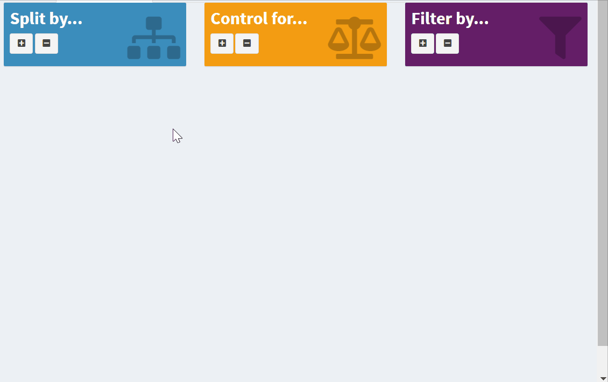
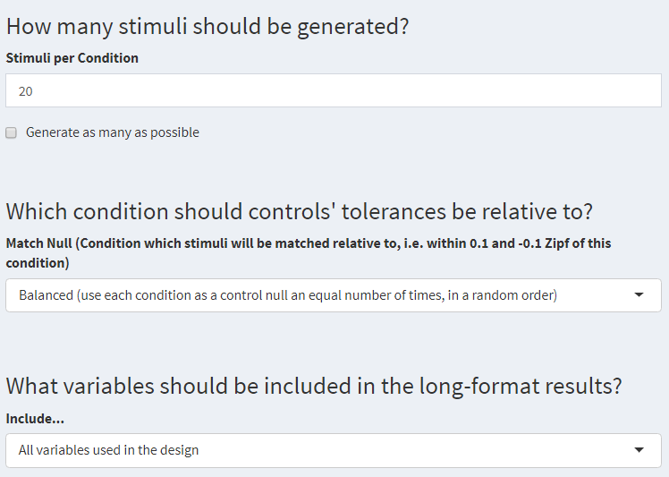
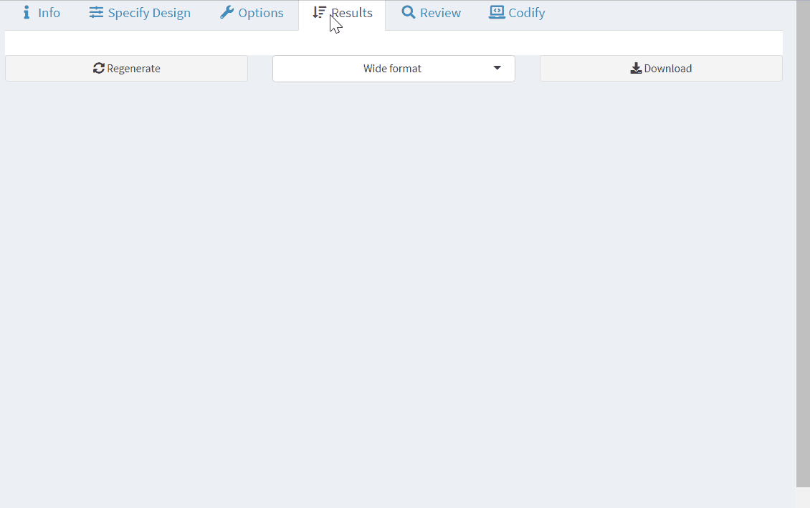
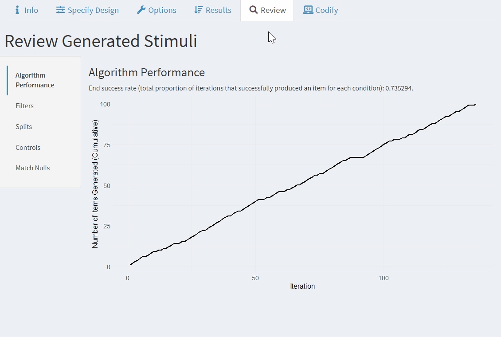
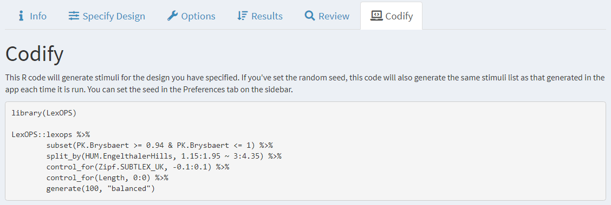
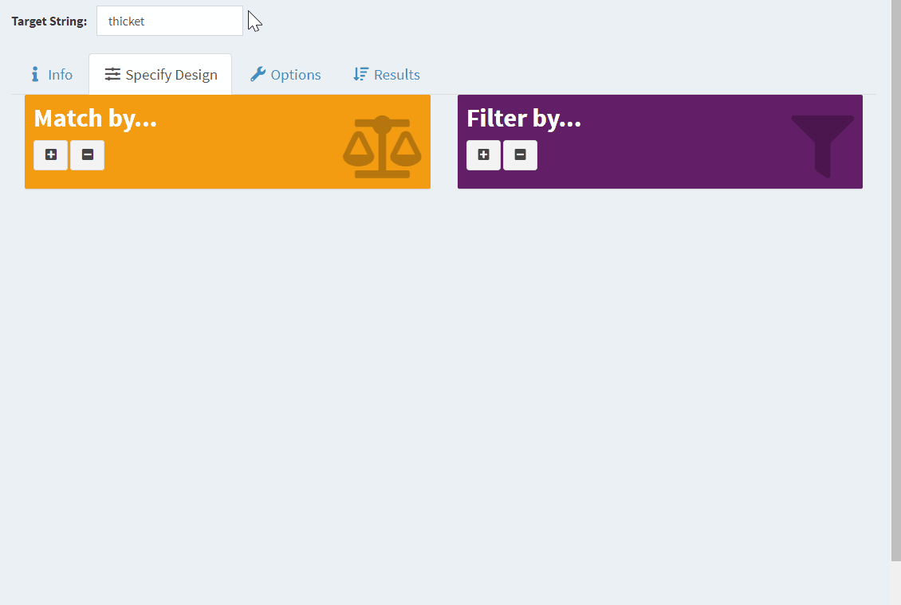
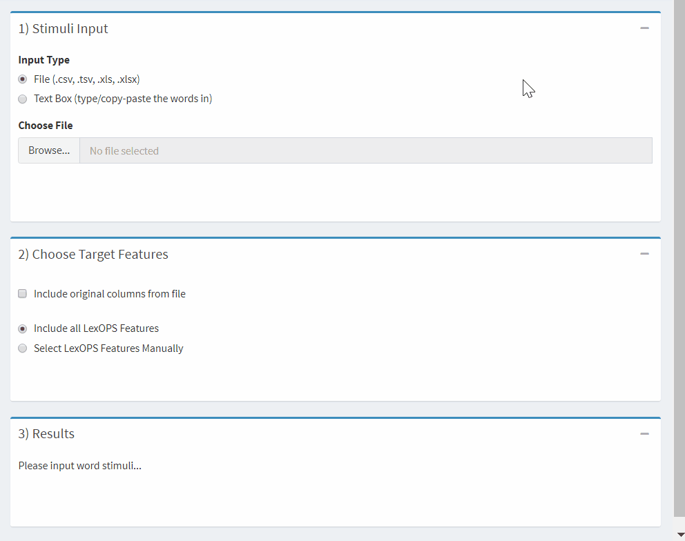
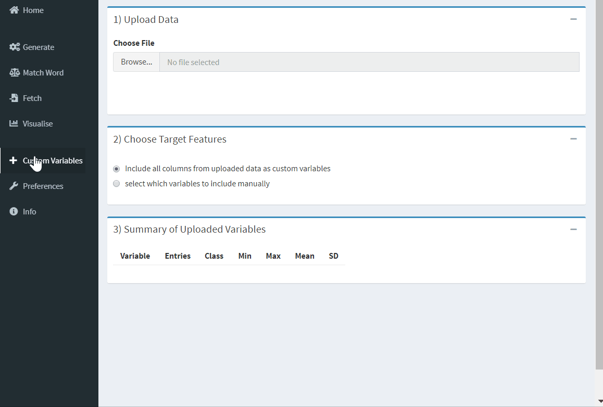

# LexOPS Shiny App

The Shiny app is an interactive user interface for LexOPS, with informative visualisations and illustrations of selected options. The LexOPS Shiny app can be run locally with:


```r
LexOPS::run_shiny()
```

The Shiny app is also available as a web app at https://jackt.shinyapps.io/lexops/, but running the app locally is recommended for reliability and speed.

## Generate

The Generate tab is a user interface for the "[generate pipeline](the-generate-pipeline.html)". This allows you to generate stimuli for any possible factorial design.

### Specify Design

Splits (independent variables), controls, and filters can be specified in the following way:

1. Click the '+' button to add a new variable.
2. Choose a variable from the drop-down menu.
3. Select a source for the variable if necessary (i.e. "according to...").
4. Specify the boundaries or tolerances

<div class="figure" style="text-align: center">

<p class="caption">(\#fig:unnamed-chunk-3)Specifying a design in the shiny app.</p>
</div>

### Options

Here you can tell the app how many stimuli should be generated per condition, which condition should be used as the match null, and which variables to include in the long-format version of the results.

<div class="figure" style="text-align: center">

<p class="caption">(\#fig:unnamed-chunk-4)Options for the Generate tab.</p>
</div>

### Results

This is where you can see the generated stimuli. A different set of stimuli which fit the design will be generated each time the "Regenerate" button is clicked. You can switch between viewing the stimuli in wide or long format, and can download the stimuli in either format as a file: `generated_stimuli.csv`.

<div class="figure" style="text-align: center">

<p class="caption">(\#fig:unnamed-chunk-5)Generating stimuli and viewing the results.</p>
</div>

### Review

Once the stimuli have been generated, this section allows you to view a summary of the generated stimuli. You can view how splits, controls, and filters differ between conditions and across matched items (which calls the `plot_design()` function). You can also view the cumulative item generation (from the `plot_iterations()` function), and check the distribution of the match nulls.

<div class="figure" style="text-align: center">

<p class="caption">(\#fig:unnamed-chunk-6)Reviewing generated stimuli.</p>
</div>

### Codify

This is a handy feature that lets you translate the selected options into LexOPS R code to reproduce the design. To reproduce a specific stimulus list, set the seed in the Preferences tab.

<div class="figure" style="text-align: center">

<p class="caption">(\#fig:unnamed-chunk-7)Translate selected options into LexOPS R code.</p>
</div>

## Match Word

The Match Word tab is a user interface for the [`match_word()` function](matching-individual-words.html). As in the Generate tab, you can specify variables that should be matched by (with tolerances relative to the target string) and filtered by (with boundaries independent of the target string). You can then view and download the suggested matches.

<div class="figure" style="text-align: center">

<p class="caption">(\#fig:unnamed-chunk-8)Matching individual words in the Match tab.</p>
</div>

## Fetch

The Fetch tab is an easy way to get values from the LexOPS database (or uploaded in the [Custom Variables](#custom-variables) tab) for your own list of words. As an example, I may have a file, `my_stimuli.csv`, with the following contents:

<div class = 'skinny'>

word         likert_rating   mean_RT
----------  --------------  --------
pigeon                1.40     456.0
dog                   5.20     423.5
wren                  6.00     511.0
symbiosis             4.44     503.2
shark                 4.20     482.3

</div>

I could then upload this to the Fetch tab. This will return the known values from the [LexOPS dataset](introduction.html#the-lexops-dataset) for my list of stimuli:

<div class="figure" style="text-align: center">

<p class="caption">(\#fig:unnamed-chunk-10)Fetching the features of a stimulus list.</p>
</div>

## Visualise

The Visualise tab provides many options for plotting useful information. As well as the variables included in the [LexOPS dataset](introduction.html#the-lexops-dataset) and [custom variables](#custom-variables), the Visualise tab can plot information from within the app, such as the generated condition.

Here's an example of application of the visualise tab to look at stimuli generated in the Generate tab (in a Bigram Probability x Concreteness design). Points can be coloured by things like generated condition, and individual words can be identified by hovering over the points.

<div class="figure" style="text-align: center">

<p class="caption">(\#fig:unnamed-chunk-11)Example usage of the Visualise tab.</p>
</div>

## Custom Variables

The Custom Variables tab is useful for integrating variables not in the LexOPS dataset to the app. Importantly, the words which have custom variables can be in any language. These variables can then be used within the app for generating stimuli. Custom variables are only available for the current session.

Here is an example in which the variables from the [Leipzig Affective Norms for German (LANG) (Kanske & Kotz, 2010)](http://doi.org/10.3758/BRM.42.4.987) are added to the LexOPS shiny app. These variables can then be used in the Generate tab.

<div class="figure" style="text-align: center">

<p class="caption">(\#fig:unnamed-chunk-12)Example usage of the Visualise tab.</p>
</div>

The Custom Variables tab uses [dplyr's join functions](https://dplyr.tidyverse.org/reference/join.html). An equivalent to using custom variables in R code would be to either join the custom variables to the LexOPS dataset using dplyr's join functions, or to just run the generate pipeline on a dataframe of custom variables.
