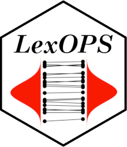

--- 
title: "LexOPS Walkthrough"
author: "Jack Taylor"
date: "2021-03-15"
site: bookdown::bookdown_site
documentclass: book
bibliography: [book.bib, packages.bib]
biblio-style: apalike
link-citations: yes
description: "An introduction to the LexOPS package and how to use it."
---

# Overview {-}

LexOPS is an R package and shiny app for generating controlled stimuli, for use in Psychology experiments. LexOPS can generate stimuli for a factorial design specified by the user, controlling for selected variables. The package has an inbuilt database of features for English words (`LexOPS::lexops`), but the package can work with any database which includes features for a finite set of items. This means LexOPS can generate stimuli for words from any language based on any list of features, and can even work with stimuli which are nothing to do with words (e.g. faces).

This site explains most features of LexOPS, and provides some example applications.

## Useful Links {-}

<i class="fa fa-file-pdf-o"></i> Paper about LexOPS: http://doi.org/10.3758/s13428-020-01389-1

<i class="fa fa-quote-left"></i> Cite LexOPS: [FAQ - How should I cite LexOPS](faq.html#how-should-i-cite-lexops)

<i class="fa fa-github"></i> GitHub Repository: https://github.com/JackEdTaylor/LexOPS

